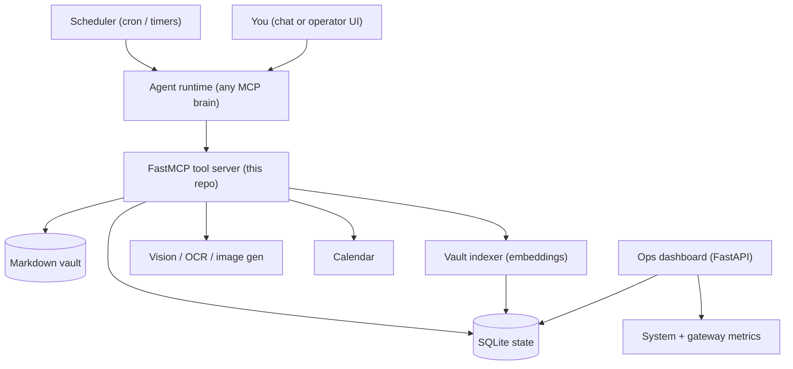

# Architecture

AI Ops Agent is a **tool server plus an operating loop** around it. It separates
three concerns so you can change any one without touching the others:

1. **Tools (this repo)** - a FastMCP server exposing 24 typed tools over vault,
   tasks, daily state, calendar, multimodal, and search. Deterministic and
   model-agnostic.
2. **Runtime (the brain)** - a model-swappable, MCP-capable agent runtime that
   decides what to do and calls the tools. Any MCP runtime works.
3. **Schedule (the crons)** - the triggers that wake the runtime: a morning
   brief, an evening digest, a weekly review, and background sweeps. You edit
   these per setup.

Nothing here is tied to one person's data. The vault, database, and prompts are
yours; point the paths at your own and the same engine runs.

## Flow



## Components

- `scripts/agent_mcp.py` - the FastMCP server: 24 tools for vault read/append,
  tasks, daily state (mood, activity, workouts), voice-note archival, calendar,
  vision/video/OCR/image-generation, semantic search, read-only SQL, and web
  search/fetch.
- `scripts/agent_db.py` - the SQLite schema and CLI: `init` creates the full
  schema; commands read and write tasks, streaks, activity, body, capital memos,
  voicenotes, media, and vault chunks.
- `scripts/vault_index.py` - incremental embedding indexer: chunks changed
  markdown files by heading, embeds them, and stores vectors in SQLite for
  `semantic_search`.
- `scripts/dashboard_main.py` + `scripts/dashboard_index.html` - a FastAPI
  mission-control dashboard: system metrics, gateway uptime, scheduled jobs,
  recent logs, per-model token usage, and estimated cost.
- `scripts/daily_digest.py` - assembles the day (tasks, mood, activity,
  voicenotes, notes) into a digest payload the runtime turns into a journal
  entry.
- `scripts/tasks_md_sweep.py` - keeps the Obsidian-style `tasks.md` mirror in
  sync with the database (ticking a box closes the task).
- `scripts/voicenote_sweep.py` - archives orphaned voice notes that were not
  captured during a live turn.
- `scripts/models.py` - the model-tier registry (flagship / mid / cheap / vision
  / ocr / image / embed). Swapping a model is a one-line edit here.

## The scheduled loop (crons)

The runtime is driven by a handful of scheduled tasks. This is the part you tune;
the defaults are editable in [`config.example.json`](config.example.json):

- **Morning brief** - pull open tasks, calendar, recent state, and vault context
  into a short brief.
- **Evening digest** - assemble the day and write a journal entry.
- **Weekly review** - roll up the week and update the agent's own memory.
- **Sweeps** - re-index the vault, sync the task mirror, and archive stray voice
  notes on a short cadence.

This repo does not ship a scheduler of its own: wire these to cron, systemd
timers, or your runtime's scheduler.

## State and files

Writable state lives under `AGENT_VAULT_DIR` (defaults to `~/vault`):

```text
<AGENT_VAULT_DIR>/
├── db.sqlite        # tasks, streaks, activity, body, notes, digests, media, vault chunks
├── journal/         # daily and weekly entries the runtime writes
├── tasks.md         # generated mirror of open tasks (Obsidian-compatible)
└── inbox/generated/ # generated images
```

Secrets load from the process environment, then the optional `AGENT_ENV_FILE`.
The vault path, runtime directory, and gateway unit/port are all set through
`AGENT_*` environment variables (see `.env.example`).

## Deployment

- **Local** - run the tool server and dashboard on demand, driven by your
  runtime. Good for testing and operator-in-the-loop use.
- **VPS (always-on)** - run the runtime and its scheduler under a process manager
  (systemd, pm2, supervisor) so the daily loop runs around the clock. Keep
  credentials in a server env file outside git.

## Design choices

- **Narrow, stateful tools.** The runtime decides; the tools own filesystem
  writes, database updates, and path safety (vault paths are resolved under the
  vault root and reject escapes; free-form SQL is read-only).
- **Structured and reflective state are split.** SQLite holds structured data
  (tasks, activity); markdown holds reflective, long-form entries.
- **Retrieve before speaking.** Scheduled workflows gather evidence first, then
  produce the smallest useful prompt, rather than free-associating.
- **Model-swappable.** The tool layer is independent of the brain; change the
  runtime or the models without touching the tools.
- **Observable.** The dashboard turns the agent from a black-box loop into a
  service you can watch: uptime, jobs, token usage, and cost in one place.
