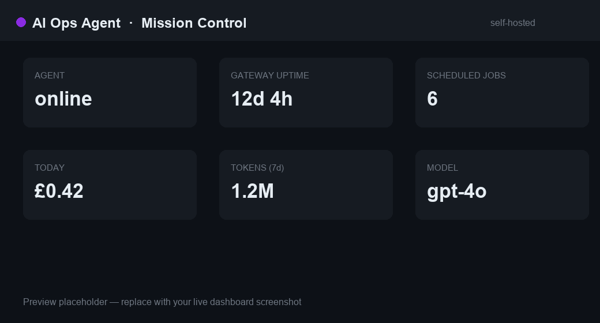
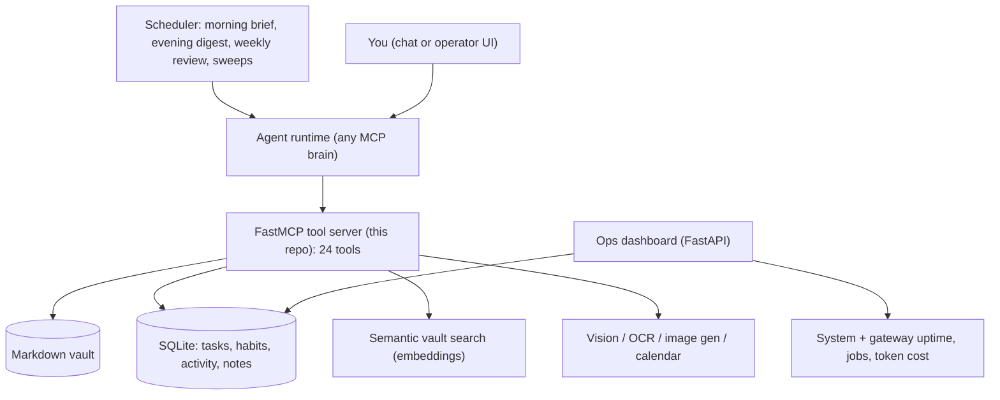

<div align="center">

# AI Ops Agent

**A private operations control center for notes, tasks, calendar context, and
scheduled briefings.** Run it with any MCP-capable agent runtime, keep the data
in your own vault, and watch the loop from a simple dashboard.

[](LICENSE)
[](https://github.com/mirasolutions06/ai-ops-agent/actions/workflows/ci.yml)


[Architecture](ARCHITECTURE.md) · [Workflows](docs/workflows.md) · [Tool catalog](docs/tool-catalog.md) · [Runbook](RUNBOOK.md)



</div>

## At a glance

This repo is the reusable core of a self-hosted operations agent. It gives an
agent runtime deterministic tools for reading a private vault, managing tasks,
building scheduled briefs, archiving voice notes, and exposing operational state
through a dashboard.

| This repo owns | You provide |
|---|---|
| FastMCP tool server, SQLite state, vault-safe file helpers, scheduled scripts, dashboard, tests | Your vault, your agent runtime, provider keys, scheduler, chat or operator UI |

## Common workflows

| Workflow | What happens |
|---|---|
| Morning brief | Pull open tasks, calendar context, recent notes, and vault search into a short planning brief. |
| Task capture | Add, list, close, and mirror tasks into a markdown file that is easy to review or edit by hand. |
| Voice-note routing | Archive audio plus transcript, then route the note into a task, journal entry, or vault note. |
| Evening digest | Summarize the day and write a journal-ready payload from tasks, mood, activity, notes, and voice notes. |
| Weekly review | Roll up the week, preserve decisions, and prepare the next planning loop. |
| Ops dashboard | Check uptime, scheduled jobs, logs, token usage, estimated cost, and database-backed state. |

## Repository map

| Path | What it contains |
|---|---|
| `scripts/agent_mcp.py` | The MCP tool server the agent runtime connects to. |
| `scripts/agent_db.py` | SQLite schema and task/state helpers. |
| `scripts/dashboard_main.py` | FastAPI dashboard for status, jobs, logs, and costs. |
| `config.example.json` | Safe starter config for paths, models, and schedule. |
| `ARCHITECTURE.md` | System design and data-flow notes. |
| `docs/workflows.md` | Plain-English description of the daily and weekly loops. |
| `docs/tool-catalog.md` | Public tool surface grouped by job-to-be-done. |
| `RUNBOOK.md` | Setup, operations, and deployment checklist. |
| `scripts/tests/` | No-secret tests for database, digest, tools, and smoke paths. |

## Why

Most "AI assistants" are a chat box that forgets everything and does nothing when
you stop typing. This is the opposite: an agent with an operating loop. It wakes
on a schedule, keeps durable memory in a markdown vault and SQLite, does real
work through typed tools, and only ever writes inside safe boundaries. You run
it, you own the data, and the dashboard shows you exactly what it is doing.

The hard part was never "call an LLM." It was the operating system around it: what
the agent should know before it speaks, which actions are deterministic tools
instead of model guesses, and how state survives across days. This repo is that
operating system, generalised so you can point it at your own vault, models, and
schedule.

## What it does

| Capability | What you get |
|---|---|
| **Memory vault** | Read, append, and search a private markdown vault; a background indexer embeds it for semantic recall. |
| **Tasks and routines** | Task lifecycle in SQLite, mirrored to an Obsidian-compatible `tasks.md`; habit streaks; daily activity and mood. |
| **Scheduled loop** | Morning brief, evening digest (writes a journal entry), weekly review, plus sweeps that keep the index and task mirror in sync. |
| **Voice notes** | Archive audio and transcript, then route by shape into tasks, notes, or longer entries. |
| **Multimodal** | Image and video analysis, OCR, and text-to-image, behind one tool surface. |
| **Ops dashboard** | A FastAPI mission-control panel: agent status, uptime, scheduled jobs, logs, token usage, and cost. |

**24 MCP tools** in total: vault (`vault_read`, `vault_append`, `vault_tree`,
`semantic_search`), tasks and state (`task_add`, `task_close`, `task_list`,
`tasks_render_md`, `mood_log`, `note_quick`, `activity_log`, `activity_update`,
`workout_archive`, `voicenote_archive`), calendar (`calendar_list`,
`calendar_add`, `calendar_delete`), multimodal (`vision_analyze`,
`video_analyze`, `ocr_extract`, `image_generate`), and data (`query_db`,
`web_search`, `web_fetch`).

## How it works

Three layers you change independently: the **tool server** (this repo), the
**agent runtime** that drives it (any MCP-capable brain), and the **schedule**
that wakes it.



Full detail in [ARCHITECTURE.md](ARCHITECTURE.md).

## Quick start

```bash
python3 -m venv .venv && . .venv/bin/activate
make install
make test          # 17 passing + 1 skipped, no live secrets needed
make db-init        # create the SQLite schema
```

Run the tool server or the dashboard locally:

```bash
# MCP tool server (stdio)
AGENT_VAULT_DIR="$PWD/.vault" python3 scripts/agent_mcp.py

# ops dashboard at http://localhost:7474
AGENT_VAULT_DIR="$PWD/.vault" python3 scripts/dashboard_main.py
```

## Configure it for your setup

Copy `config.example.json` to `config.json` and set your vault path, the model for
each tier (`scripts/models.py`), and the schedule. Point the paths at your own
vault and runtime with the `AGENT_*` variables in `.env.example`. Wire the tool
server to an MCP runtime and a scheduler, and run it locally or on a VPS for
always-on operation. Step by step in [RUNBOOK.md](RUNBOOK.md).

Defaults to OpenAI (`gpt-4o` and friends); switch to any OpenAI-compatible
provider (z.ai, DeepSeek, a local server) with a one-line edit in `models.py`.

## Built with

Python · [MCP](https://modelcontextprotocol.io) (FastMCP) · SQLite · FastAPI ·
OpenAI-compatible model providers. No framework lock-in; the tool layer is plain
Python behind a typed MCP surface.

## Safety and privacy

Credentials never live in the repo (`.env` locally, or a server env file via
`AGENT_ENV_FILE`). Vault paths are resolved under the vault root and reject
escapes; free-form SQL is read-only. No hostnames, IPs, vault contents, or
personal data are committed. The included config is a template, not a dump from a
real deployment.

## License

MIT, see [LICENSE](LICENSE). Use it, fork it, adapt it for your own setup.
