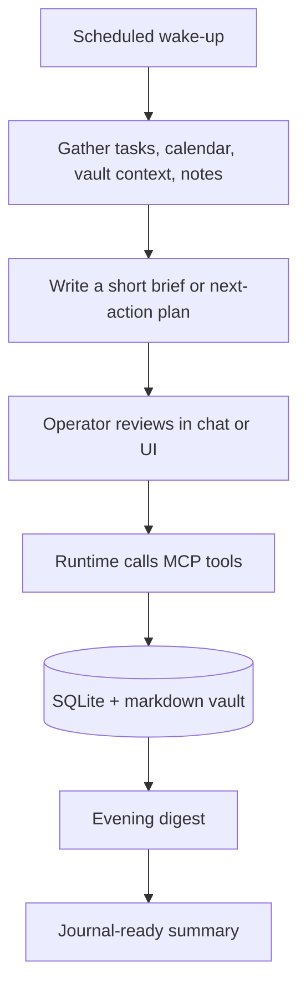

# Workflows

This repo is a tool layer, not a personality or private vault. The workflows
below are the safe, reusable shapes it supports when connected to an MCP-capable
agent runtime and a scheduler.

## Daily loop



## Morning brief

The morning brief is a planning pass. It should collect open tasks, near-term
calendar events, recent notes, and a small amount of vault context before the
runtime writes anything. The goal is a useful next-action view, not a long
essay.

Typical inputs:

- `task_list` for open work.
- `calendar_list` for the next day or week.
- `semantic_search` for relevant vault context.
- Recent notes, activities, and voice-note transcripts from SQLite.

## Task capture and mirror

Tasks live in SQLite so tools can update them safely, but they can also be
rendered to a markdown mirror for human review. That gives you both reliable
state and a simple file you can read or edit.

Supported actions:

- Add tasks from chat, voice notes, or scheduled review.
- Close tasks by id or text match.
- List tasks by status.
- Render an Obsidian-compatible `tasks.md` mirror.

## Voice-note routing

Voice notes are archived with audio path, transcript, category, and routing
metadata. The runtime can then decide whether the transcript should become a
task, a quick note, a longer vault entry, or raw journal context.

Keep private routing prompts out of the public repo. A safe public example is:

```text
If the transcript contains a commitment, create a task.
If it captures an idea, append it to the inbox.
If it is reflective, leave it for the evening digest.
```

## Evening digest

The digest script assembles a factual payload from structured state:

- tasks completed or still open
- mood and activity logs
- quick notes
- voice-note summaries
- simple flags such as stalled work or missing activity

The runtime can turn that payload into a journal entry, but the data gathering is
deterministic and testable.

## Weekly review

The weekly review is the same idea at a longer horizon: collect completed work,
stalled tasks, recurring themes, useful notes, and the next set of priorities.
Keep this generic in public docs; deployment-specific reflection prompts belong
in private runtime configuration.

## Dashboard review

The dashboard is for operational confidence. It shows status, recent logs,
scheduled jobs, uptime, token usage, and estimated cost so the agent loop is not
a black box.
